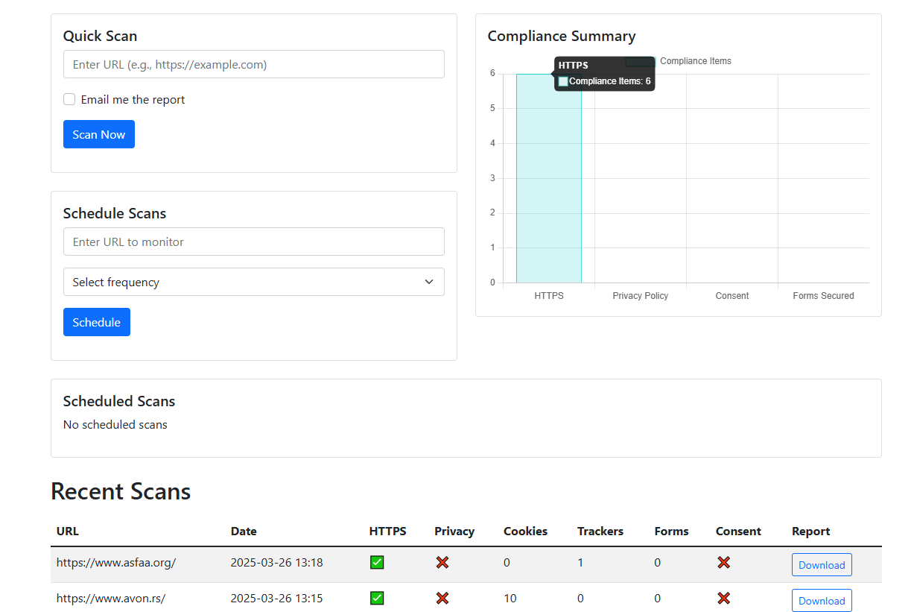
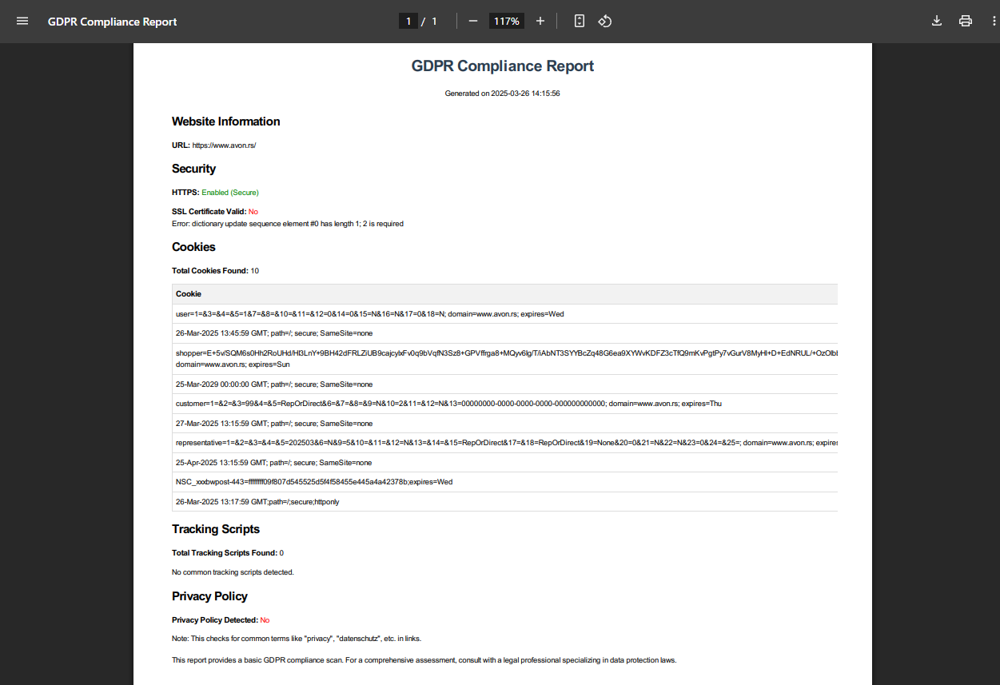

# 🔍 GDPR Compliance Scanner 🛡️

**Automated GDPR Compliance Monitoring with Advanced Scanning Capabilities**

[](https://python.org)
[](https://flask.palletsprojects.com/)


A powerful automated scanner that helps websites maintain GDPR compliance through continuous monitoring and detailed reporting. Perfect for developers, site administrators, and privacy-conscious organizations!
### Dashboard Preview

### PDF Report Preview


## 🌟 Key Features

- **🔒 Comprehensive Security Checks**
  - HTTPS verification
  - SSL/TLS certificate analysis
  - Vulnerability scanning (including Heartbleed check)
  
- **🍪 Cookie Compliance**
  - Detailed cookie classification
  - Source tracking (HTTP headers vs JavaScript)
  - Session/secure flag verification

- **📜 Privacy Policy Audit**
  - Automatic policy detection
  - GDPR keyword analysis
  - Content scoring system

- **📈 Continuous Monitoring**
  - Scheduled scans (daily/weekly/monthly)
  - Automated email reports
  - Historical compliance trends

- **📊 Rich Reporting**
  - Instant PDF reports
  - Visual dashboard with charts
  - Executive summary & technical details

## 🚀 Quick Start

### Requirements
- Python 3.8+
- wkhtmltopdf
- Chrome/Chromium browser

### Installation
```bash
# Clone repository
git clone https://github.com/yourusername/gdpr-scanner.git
cd gdpr-scanner
```
# Install dependencies
```bash
pip install -r requirements.txt
```

## Configuration
Update app.py with your settings:

```python
app.config['SECRET_KEY'] = 'your-secure-key'
app.config['MAIL_USERNAME'] = 'your@email.com'
app.config['MAIL_PASSWORD'] = 'email-password'
```
*Ensure wkhtmltopdf path is correct for your OS*

## Running
```bash
flask run --host=0.0.0.0 --port=5000
```
Visit http://localhost:5000 to start scanning!

# 🛠️ Usage Guide
1. **User Authentication** 👤

- Register new account

- Secure password hashing

2. **Quick Scans** ⚡

- Enter any website URL

- Get instant compliance report

- Download PDF or email directly

3. **Scheduled Monitoring** ⏰

- Set up recurring scans

- Configure notification emails

- Track compliance history

4. **API Endpoints** 🌐

- /scan - POST scan requests

- /schedule - Manage monitoring

- /report/<id> - Retrieve PDFs

# 📚 Technology Stack
- **Core**: Python + Flask

- **Security**: OpenSSL, Werkzeug

- **Web**: BeautifulSoup, Requests

- **Reporting**: PDFkit, Chart.js

- **Database**: SQLAlchemy + SQLite

- **Scheduling**: APScheduler

## 🌐 What is GDPR?
The **General Data Protection Regulation (GDPR)** is the EU's data privacy law that revolutionized how personal data must be handled globally. Enforced since **May 25, 2018**, it affects any website or app processing EU residents' data.

## 🤝 Contributing
We welcome contributions! Please see our Contribution Guidelines for details.

## ⚠️ Disclaimer
This tool provides technical compliance suggestions only. Always consult with legal professionals for full GDPR compliance verification.

Made with ❤️ by Meta | MIT License | Report Issue
